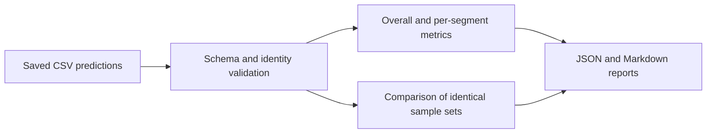

# IIoT Detection Evaluation Toolkit

A small research tool for evaluating saved binary intrusion-detection predictions from IIoT segments. Developed for Assignment 3 of Applied Software Development Project.

## Scope

The planned IDS uses local edge detection and federated learning. This repository implements its evaluation module: it reads predictions, validates observations, calculates metrics, and compares two runs on the same samples. It does not train a model or implement federated learning.

The two demonstration datasets are **synthetic**. Their predictions and latency values are manually assigned, not outputs of trained local or federated models. See [data provenance and expected scores](data/README.md).

## Quick start

Use Node.js 22.19.0 (recorded in `.nvmrc`) and npm. This exact runtime is used by CI on Linux and Windows.

```sh
git clone https://github.com/Kirun13/iiot-detection-evaluation.git
cd iiot-detection-evaluation
npm ci
npm run verify
```

The last command checks types, runs tests, builds the CLI, and evaluates both demonstration files. Results appear in `results/report.json` and `results/report.md`.

To evaluate your own saved predictions:

```sh
npm run build
npm run evaluate -- --input data/example.csv --output results
npm run evaluate -- --input data/example.csv --compare data/candidate.csv --output results
```

Use `npm run evaluate -- --help` for command syntax. Invalid arguments or data produce an explanation on stderr and exit code 1. Reports are generated only after both inputs and their comparison are validated.

## CSV contract

| Column | Meaning |
| --- | --- |
| `sample_id` | Nonempty string, unique across the entire file; leading zeros are preserved |
| `segment` | Nonempty segment name, e.g. lighting, pump, environment |
| `y_true` | Ground-truth label, exactly `0` (normal) or `1` (attack) |
| `y_pred` | Saved detector decision, exactly `0` or `1` |
| `model_version` | Nonempty identifier; exactly one model version per file |
| `latency_ms` | Optional column; if included, each row must provide a finite nonnegative decimal |

Column order may vary. UTF-8 BOM, CRLF and quoted values are supported. Unknown columns, duplicate columns, malformed row lengths, empty required values and duplicate observations are rejected.

Comparison joins by `sample_id`, not CSV row order. Both files must contain exactly the same identities, segments and ground truth. Reusing an ID for a different observation is invalid. Different sample sets are rejected even if they have equal row counts.

## Metrics and interpretation

Attack (`1`) is the positive class. The toolkit computes TP, FP, TN, FN and:

| Metric | Formula |
| --- | --- |
| Precision | TP / (TP + FP) |
| Recall | TP / (TP + FN) |
| F1 | 2 TP / (2 TP + FP + FN) |
| False positive rate | FP / (FP + TN) |
| Accuracy | (TP + TN) / n |

Ratios with zero denominators are `null` in JSON and `N/A` in Markdown. F1 is computed directly from counts: it can be zero even when precision is undefined. Reported F1 is **binary attack-class F1**, not macro-F1 over attack types.

Metrics are reported overall and by segment. Supplied latencies use nearest-rank p95: sort `n` measurements and select rank `ceil(0.95*n)` (one-based). Missing or incomplete latency produces `null`. The CLI does not measure IDS inference latency.

For the supplied fixtures:

| Run | TP | FP | TN | FN | F1 | FPR | p95 ms |
| --- | ---: | ---: | ---: | ---: | ---: | ---: | ---: |
| local-demo-v1 | 4 | 2 | 4 | 2 | 0.6667 | 0.3333 | 75 |
| hybrid-demo-v1 | 5 | 1 | 5 | 1 | 0.8333 | 0.1667 | 77 |

Deltas are candidate minus baseline; F1 increases by 1/6 and FPR decreases by 1/6 **in this invented fixture only**. These twelve observations do not establish an algorithmic advantage, confidence interval, statistical significance, or achievement of the planned full-system KPIs.

## Architecture



`validation.ts` owns the external-data contract. `metrics.ts` contains calculations, `comparison.ts` controls comparison validity, `report.ts` renders readable output, and `cli.ts` manages files and arguments. Computational modules are separated from filesystem operations for unit testing.

## Reproducibility and tests

`package-lock.json` is committed; `npm ci` installs that dependency graph. Dependency changes use `npm install` to update the lockfile, never manual lockfile edits. Reports contain the tool version, model versions, input filenames and input SHA-256 hashes. They omit timestamps and absolute paths so identical inputs and tool versions produce identical output bytes.

```sh
npm run typecheck
npm test
npm run demo
```

Tests cover independently computed metric values, zero denominators, latency percentile conventions, CSV edge cases, fair comparison, and full CLI execution. End-to-end tests confirm byte reproducibility and refusal to replace an input whose path is a report destination.

The tool reads each CSV into memory. It is intended for small offline evaluation datasets; large datasets require streaming validation and incremental aggregation. It checks file consistency, not whether labels are correct, observations are independent, or a test split has training leakage. Those remain responsibilities of the experiment protocol.

## Technology choices

TypeScript provides static checks for typed observations and report structures. Runtime validation is still needed for CSV. Node.js suits a file-processing CLI and the npm workflow. `csv-parse` handles quoting and row structure; Vitest provides automated checks without a web framework.

Python and scikit-learn would be appropriate for training scientific models. This module only evaluates existing binary predictions, so a compact TypeScript implementation avoids adding a training framework. Plain JavaScript would need the same runtime validation but would not provide the selected static checks.

## CI and delivery

- [CI workflow](.github/workflows/ci.yml): on pushes and pull requests, `npm ci`, type checks, automated tests, demo execution and `npm pack` run on Linux and Windows. Reports, JUnit results and a package archive are stored as workflow artifacts. The read-only CI token does not publish releases.
- [Release workflow](.github/workflows/release.yml): a `v*` tag must match `package.json`. After the full checks pass, the workflow publishes the package archive and demo reports to a GitHub Release. Only this job has write permission for repository contents.
- [Actions history](https://github.com/Kirun13/iiot-detection-evaluation/actions) and [releases](https://github.com/Kirun13/iiot-detection-evaluation/releases) provide run evidence.

CI checks integration. The tag-controlled release is continuous delivery of a CLI artifact; this project has no deployed web service and does not publish to the npm registry.

To use a release archive, extract the `.tgz`, enter its `package` directory, run `npm install --omit=dev`, then `node dist/cli.js --input data/example.csv --output results`. The release includes compiled files, fixtures and documentation.

## Development

Tasks are tracked through GitHub issues. Work is integrated through a feature branch and pull request, with automated validation before merge.

## License and research limits

Code and author-created fixtures use the [MIT license](LICENSE). External datasets keep their own licenses. No actual IIoT traffic or TON_IoT dataset is redistributed here. A successful test suite validates the implemented contracts and computations; it does not validate a real intrusion detector.

## Assignment report

[Assignment 3 report (PDF, 12 pages)](docs/Assignment_3_Report.pdf) covers the development lifecycle, technology choices, version control, CI/CD, scientific reproducibility and verified results.

The report and Git author/committer dates are set to 7 October 2026. GitHub's server records retain the actual execution and publication dates of 9 October 2026.
